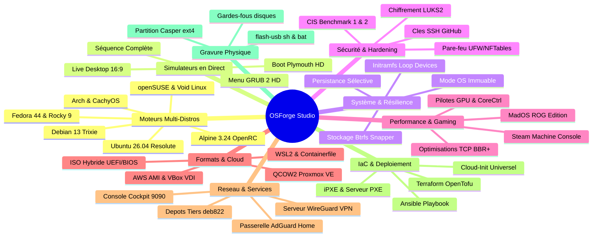

# 🚀 OSForge Studio — Constructeur Graphique d'OS Linux & ISO Builder

<div align="center">

[](https://www.patreon.com/c/LordMad)
[](https://lordmadtrix.github.io/osforge-studio/)
[-10b981?style=for-the-badge&logo=vitest&logoColor=white)](https://github.com/LordMadTrix/osforge-studio/actions)
[](https://github.com/LordMadTrix/osforge-studio)
[](https://react.dev/)
[](https://www.typescriptlang.org/)
[](https://vitejs.dev/)

**Plateforme web complète et interactive pour concevoir, personnaliser, simuler et compiler des distributions Linux sur mesure.**  
*Créé et maintenu par **LordMadTrix**.*

[🌐 Ouvrir l'Application en Ligne](https://lordmadtrix.github.io/osforge-studio/) • [📖 Documentation](#-sommaire) • [☕ Soutenir sur Patreon](https://www.patreon.com/c/LordMad)

</div>

---

## 🏛️ LE PRINCIPE FONDATEUR : « ZÉRO COSMÉTIQUE »

> **Règle absolue du projet : aucune case à cocher, aucun sélecteur n'est factice.**  
> Chaque option de l'interface graphique génère du vrai code shell bash, systemd, sysctl, deb822 ou des configurations debootstrappées vérifiées directement sur les dépôts officiels des distributions cibles.

Si un paquet ou une fonctionnalité n'existe pas sur une distribution (ex: absence de `systemctl` sous Alpine/OpenRC ou Void/Runit, absence de certains paquets sur EPEL9), le générateur refuse de mentir : il adapte l'implémentation ou avertit honnêtement l'utilisateur.

---

## 📑 SOMMAIRE

1. [🧙‍♂️ Dual-Mode UX : Wizard Débutant & Studio Pro](#-dual-mode-ux--wizard-débutant--studio-pro)
2. [🗺️ Les 9 Piliers & 27 Chantiers Majeurs](#-les-9-piliers--27-chantiers-majeurs)
3. [🖥️ Simulateurs Graphiques en Temps Réel](#-simulateurs-graphiques-en-temps-réel)
4. [🛡️ Sécurité, Durcissement & Mode OS Immuable](#-sécurité-durcissement--mode-os-immuable)
5. [🎮 Performance Gaming & Modèle MadOS ROG Edition](#-performance-gaming--modèle-mados-rog-edition)
6. [☁️ Formats d'Exportation & Virtualisation](#-formats-dexportation--virtualisation)
7. [💾 Assistant de Gravure USB avec Persistance](#-assistant-de-gravure-usb-avec-persistance)
8. [⚡ Démarrage Rapide & Lanceurs 1-Clic](#-démarrage-rapide--lanceurs-1-clic)
9. [🧪 Qualité, Tests & CI/CD](#-qualité-tests--cicd)

---

## 🧙‍♂️ DUAL-MODE UX : WIZARD DÉBUTANT & STUDIO PRO

OSForge Studio s'adapte à tous les niveaux grâce à son sélecteur de mode ergonomique situé dans l'en-tête :

### 1. Mode Guidé (Wizard Débutant)
Un parcours pédagogique en **5 étapes simples sans jargon technique** :
- **Étape 1 : Objectif & Usage** (Bureautique, Gaming Haute Performance, Serveur / Cloud, Développement, Cybersécurité).
- **Étape 2 : Bureau & Style** avec indicateur d'empreinte RAM en direct (XFCE ~350 Mo, GNOME ~850 Mo, KDE Plasma ~650 Mo, Hyprland ~450 Mo).
- **Étape 3 : Packs Logiciels en 1-Clic** (Navigateurs, Bureautique LibreOffice, Outils Développeur, Stack Gaming Steam/Proton).
- **Étape 4 : Identité & Compte Utilisateur** (Nom d'utilisateur, mot de passe, privilèges sudo et autologin).
- **Étape 5 : Support & Lancement** (ISO Live USB, Machine Virtuelle, WSL2 Windows).

### 2. Mode Expert (Studio Pro)
Pour les administrateurs système et passionnés exigeant un contrôle chirurgical à travers **6 onglets spécialisés** :
- **Distributions & Socles** (Debian 13, Ubuntu 26.04, Arch Linux, Fedora 44, Alpine 3.24, openSUSE, Void, Kali, Linux Mint).
- **Bureaux & Design System** (Fonds d'écran SVG 1080p, thèmes Plymouth, polices Fontconfig, curseurs, icônes, terminaux).
- **Paquets & Dépôts Tiers** (Catalogue ~150 logiciels réels, dépôts officiels tiers deb822, passerelle réseau).
- **Système, Noyau & Matériel** (Stockage Btrfs + snapshots Snapper, Mode Immuable, Steam Console, ROG ASUS, CoreCtrl AMD).
- **Sécurité & Pare-feu** (Score interactif 0-100 pts, durcissement CIS Benchmark 1 & 2, LUKS2, clés SSH GitHub).
- **Inspecteur de Recette** (Génération en direct de 14 formats de scripts et manifestes téléchargeables).

---

## 🗺️ LES 9 PILIERS & 27 CHANTIERS MAJEURS

Depuis la genèse du projet, 27 chantiers d'ingénierie majeurs ont été accomplis sans aucun compromis :



---

## 🖥️ SIMULATEURS GRAPHIQUES EN TEMPS RÉEL

Fini de compiler à l'aveugle ! OSForge Studio intègre deux simulateurs interactifs synchronisés en direct avec votre recette :

### 1. Simulateur de Bureau en Direct (`LiveDesktopSimulator.tsx`)
- **Cadre 16:9 Responsive** prévisualisant l'agencement réel du bureau choisi :
  - **KDE Plasma** : Barre des tâches inférieure avec horloge, widgets et plateau système.
  - **GNOME** : Barre supérieure épurée avec menu « Activités » et Dash flottant en bas.
  - **XFCE** : Barre supérieure classique et dock d'applications.
- **Rendu du fond d'écran SVG actif** (parmi 9 presets 1920x1080 générés en pur code vectoriel).
- **Fenêtre active stylisée** avec la couleur d'accentuation choisie (`accentColor`) et positionnement des boutons de fenêtre (droite standard ou gauche style macOS).
- **Terminal interactif Fastfetch** affichant le logo textuel de l'OS, les caractéristiques du système, la police monospace choisie et la palette de couleur du terminal (Tokyo Night, Catppuccin Mocha, Dracula, Nord, etc.).
- **Menu Démarrer cliquable** déployant la liste des applications favorites.
- Mode **Plein Écran 1080p**.

### 2. Simulateur de Démarrage Plymouth & GRUB 2 HD (`BootPreviewSimulator.tsx`)
- Prévisualisation fidèle des **7 thèmes de boot splash Plymouth** (`spinner`, `bgrt`, `fade-in`, `tribar`, `cyberpunk`, `matrix`, `minimal`).
- Mode **📟 GRUB HD** affichant le menu graphique d'amorçage avec compte à rebours interactif.
- Mode **⚡ Séquence** enchaînant automatiquement GRUB ➔ Plymouth ➔ Bureau Fastfetch.

---

## 🛡️ SÉCURITÉ, DURCISSEMENT & MODE OS IMMUABLE

### 1. Mode « OS Immuable » (Anti-Malware & Kiosk)
- **Racine système montée en lecture seule stricte (`ro`)**.
- **Couche volatile en RAM** : Hook initramfs `/etc/initramfs-tools/scripts/init-bottom/01_overlay_root` superposant un `tmpfs` à la volée sur la racine. À chaque redémarrage, toute modification ou malware est immédiatement et définitivement effacé.
- **Persistance sélective** : Option pour créer le dossier `/home/$user/Persistent` permettant de conserver ses documents personnels sans exposer l'intégrité de l'OS.

### 2. Chiffrement Intégral du Disque LUKS2
- Formatage `cryptsetup luksFormat --type luks2`, création de la table `/etc/crypttab`, arguments noyau `rd.luks.name=` / `cryptdevice=` et fermeture propre des conteneurs chiffrés.

### 3. Durcissement CIS Benchmark (Niveaux 1 & 2)
- Paramètres `/etc/sysctl.d/99-cis-security.conf` désactivant les redirections ICMP, le routage source et protégeant contre le spoofing SYN.
- Désactivation stricte des core dumps (`/etc/security/limits.d/10-cis-coredumps.conf`) et blocage des protocoles vulnérables (DCCP, SCTP, RDS, TIPC).

### 4. Dépôts Tiers Modernes (APT Keyrings & deb822)
- Bannissement définitif de la commande dépréciée `apt-key`.
- Trousseaux GPG binaires dearmored dans `/etc/apt/keyrings/*.gpg` et fichiers sources modernes `/etc/apt/sources.list.d/*.sources` avec directive `Signed-By` pour **VSCodium, Docker CE, WineHQ (avec multilib i386), NodeSource 22 LTS, XanMod Kernel, Brave Browser et LibreWolf**.

---

## 🎮 PERFORMANCE GAMING & MODÈLE MADOS ROG EDITION

Inspiré des optimisations de **LordMadTrix**, OSForge Studio propose un modèle dédié au jeu sur PC et console de salon :

- **Preset MadOS ROG Edition** : Ubuntu 24.04 LTS + KDE Plasma + noyau XanMod EDGE + Gaming Stack complète Proton/Gamescope/MangoHUD + TLP.
- **Tuning Réseau & Noyau Anti-Lag TCP BBR+** :
  ```ini
  net.core.default_qdisc = fq
  net.ipv4.tcp_congestion_control = bbr
  net.ipv4.tcp_fastopen = 3
  vm.swappiness = 10
  vm.max_map_count = 2147483642
  ```
- **Mode « Steam Machine » (Living Room Console)** :
  - Session autonome Gamescope Steam GamepadUI `/usr/local/bin/steam-gamescope-session`.
  - Règles UDEV officielles pour manettes de jeu (`70-steam-input.rules`) : Xbox One/Series, Sony DualSense PS5, Nintendo Switch Pro et 8BitDo.
- **Gestion Matérielle GPU** : Pilotes NVIDIA DRM (`modeset=1`), règles polkit CoreCtrl pour overclocking/undervolting AMD, et utilitaires ASUS ROG (`asusd`, `supergfxctl`).

---

## ☁️ FORMATS D'EXPORTATION & VIRTUALISATION

OSForge Studio ne produit pas uniquement des ISOs bootables classiques :

| Format | Fichier Généré | Cas d'Usage |
| :--- | :--- | :--- |
| **ISO Hybride** | `build.sh` | Clé USB bootable, DVD, amorçage universel BIOS hérité et UEFI |
| **Disques Virtuels** | `qcow2`, `vmdk`, `vhdx`, `raw` | Hyperviseurs QEMU/KVM, VMware ESXi/Workstation, Hyper-V, Proxmox |
| **Proxmox VE Template** | `deploy-proxmox.sh` | Template VM Cloud-Init avec `qemu-guest-agent` déployable en 1 commande `qm` |
| **AWS AMI EC2** | `upload-aws-ami.sh` | Image sparse brute avec script d'import snapshot AWS CLI |
| **Oracle VirtualBox** | Image `.vdi` | Conversion native optimisée `qemu-img convert -O vdi` |
| **Windows WSL2** | `install-wsl.bat` | Archive RootFS importable directement dans le sous-système Windows |
| **Conteneurs OCI** | `Containerfile` / `Dockerfile` | Image conteneur multi-stage pour Podman et Docker |
| **Raspberry Pi** | `build-rpi-sd.sh` | Image brute double-partition pour Raspberry Pi 4 et 5 (aarch64) |
| **Infrastructure as Code** | `playbook.yml` / `main.tf` | Déploiement automatisé via Ansible et Terraform / OpenTofu |
| **Réseau iPXE / PXE** | `boot.ipxe` / `setup-pxe.sh` | Amorçage sans disque physique via le réseau local (TFTP/HTTP) |

---

## 💾 ASSISTANT DE GRAVURE USB AVEC PERSISTANCE

Générez des clés USB prêtes pour un usage quotidien avec persistance des fichiers :

- **Script Bash (`flash-usb.sh`) & Windows Batch (`flash-usb.bat`)** :
  - Détection automatique et liste claire des clés USB connectées (`lsblk`).
  - **Gardes-fous stricts** : Vérification dynamique interdisant formellement de sélectionner le disque hébergeant `/` ou `/boot`.
  - Gravure directe de l'ISO avec affichage de la progression en temps réel (`dd status=progress conv=fdatasync`).
  - **Partition de Persistance Casper / Debian Live** : Partitionnement automatique de l'espace restant sur la clé, formatage `mkfs.ext4 -F -L persistence` et injection du fichier `/persistence.conf` (`/ union`). Vos documents et réglages sont conservés entre chaque redémarrage Live !

---

## 🌐 MODE RÉSEAU ISOLÉ & DÉPÔTS HORS-LIGNE (AIR-GAPPED BUILDER)

Compilez votre distribution Linux sur des machines complètement déconnectées d'Internet ou en environnement hautement sécurisé (salle blanche, bunker, réseau isolé) :
- **Script Autonome `bundle-offline-cache.sh`** : À lancer sur une machine connectée pour pré-télécharger l'intégralité des paquets et dépendances nécessaires sans les installer (`apt-get --download-only`, `pacman -Syw`, `dnf download --resolve --alldeps`).
- **Indexation Locale Réelle** : Génération des métadonnées du dépôt miroir local (`dpkg-scanpackages . /dev/null | gzip -9c > Packages.gz` pour Debian, `repo-add` pour Arch, `createrepo_c` pour Fedora/RPM).
- **Archive Autonome `.tar.gz`** : Bundle facilement transférable sur clé USB ou disque externe vers la machine isolée.
- **Compilation 100% Hors-Ligne dans `build.sh`** : Configuration automatique des sources `file:/var/cache/offline-cache` avec `[trusted=yes]`, timeout minimal d'acquisition et suppression de tout appel réseau externe.

---

## ⚡ DÉMARRAGE RAPIDE & LANCEURS 1-CLIC

### 🪟 Sous Windows
Double-cliquez sur **`launch.bat`** à la racine du projet :
```cmd
launch.bat
```
Il intègre un menu interactif complet :
1. **Démarrer OSForge Studio** (démarre le serveur Vite et ouvre votre navigateur).
2. **Compiler le projet web** (`npm run build`).
3. **Vérifier le code** (`npm run lint` / Oxlint).
4. **Installer la distribution dans Windows WSL2** (`install-wsl.bat`).
5. **Tester l'ISO en Live avec QEMU** (`run-live-windows.bat` avec accélération matérielle WHPX).
6. **Tout automatiser en 1-clic** (`auto-build.bat`) : installe les dépendances, compile l'ISO et démarre la VM sans aucune intervention.

### 🐧 Sous Linux & macOS
```bash
chmod +x launch.sh
./launch.sh
```

---

## 🧪 QUALITÉ, TESTS & CI/CD

Le projet fait l'objet d'une exigence de qualité industrielle :

```
 RUN  v4.1.11 D:/osbuilder

 ✓ src/services/aiAssistant.test.ts (12 tests)
 ✓ src/services/generators/usbFlash.test.ts (5 tests)
 ✓ src/services/generators/branding.test.ts (24 tests)
 ✓ src/data/wizardSteps.test.ts (7 tests)
 ✓ src/data/presets.test.ts (12 tests)
 ✓ src/services/generators/advancedFeatures.test.ts (13 tests)
 ✓ src/services/scriptGenerators.test.ts (566 tests)

 Test Files  7 passed (7)
      Tests  639 passed (639)
   Duration  579ms
```

- **Oxlint** : **0 warning, 0 erreur** sur l'intégralité des 67 fichiers source.
- **Double CI/CD GitHub Actions** : Validation systématique des tests Vitest et déploiement automatique sur GitHub Pages.

---

## ☕ SOUTENIR LE CRÉATEUR (LORDMADTRIX)

OSForge Studio est un projet open-source indépendant développé avec passion. Si ce projet vous est utile :

- 💖 **Soutenir sur Patreon** : [patreon.com/c/LordMad](https://www.patreon.com/c/LordMad)
- ⭐ **Donner une étoile sur GitHub** : [github.com/LordMadTrix/osforge-studio](https://github.com/LordMadTrix/osforge-studio)
- 🌐 **Tester en direct l'application web** : [lordmadtrix.github.io/osforge-studio](https://lordmadtrix.github.io/osforge-studio/)

---

<div align="center">
  <sub>Conçu par LordMadTrix • 100% Zéro Cosmétique • Sous licence MIT</sub>
</div>
